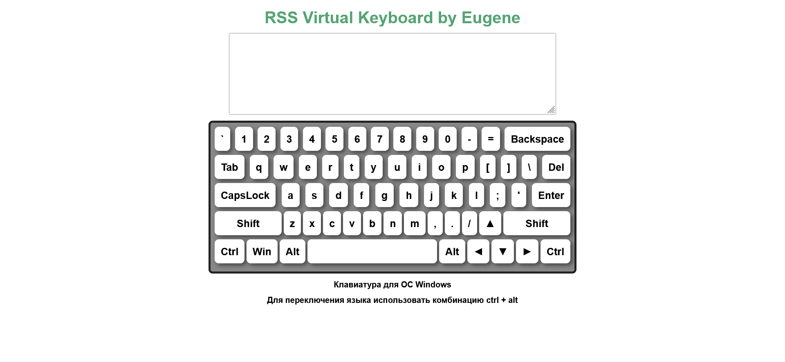

# Virtual Keyboard

# [Portfolio page](https://eugenezanevskij.github.io/virtual-keyboard/)

Virtual Keyboard - is a page used to emulate a standard keyboard by pressing keys using keyboard or mouse which inputs characters to the input field.

## Key points:

- Everything is generated with the usage of JS
- Pressing a key on a physical keyboard highlights the key on the virtual keyboard
- Virtual keyboard is able to switch between English and Russian
- Keystrokes are animated
- Mouse clicks on buttons of the virtual keyboard or pressing buttons on a physical keyboard inputs characters to the input field
- Built using BEM methodology- valid semantic adaptive layout
- Using JavaScript to implement the functionality

## Table of contents

- [Overview](#overview)
  - [The challenge](#the-challenge)
  - [Screenshot](#screenshot)
  - [Links](#links)
- [My process](#my-process)
  - [Built with](#built-with)
  - [What I learned](#what-i-learned)
- [Author](#author)

## Overview

### The challenge

- the generation of DOM elements is implemented. body in the index.html is empty (can contain only script tag)
- pressing a key on a physical keyboard highlights the key on the virtual keyboard (you should check keystrokes of numbers, letters, punctuation marks, backspace, del (if it's present), enter, shift, alt, ctrl, tab, caps lock, space, arrow keys)
- switching keyboard layouts between English and another language is implemented. Selected language should be saved and used on page reload. A keyboard shortcut for switching a language should be specified on the page
- mouse clicks on buttons of the virtual keyboard or pressing buttons on a physical keyboard inputs characters to the input field (text area)
- animation of pressing a key is implemented
- ESLint is used
- ES6 features are used

### Screenshot

Desktop version

### Links

- Solution URL: [Virtual Keyboard page](https://github.com/EugeneZanevskij/virtual-keyboard)
- Live Site URL: [Virtual Keyboard page](https://eugenezanevskij.github.io/virtual-keyboard/)

## My process

### Built with

- Semantic HTML5 markup
- Flexbox
- BEM
- JS
- ES6
- DOM API
- ESLint
- Keyboard and mouse events

### What I learned

This was the first project I used ESLint for my code.
I worked with keyboard and mouse events, DOM creation, localStorage access.

## Author

- LinkedIn - [Eugene Zanevskij](https://www.linkedin.com/in/eugene-zanevskij/)
- GitHub - [@EugeneZanevskij](https://github.com/EugeneZanevskij)